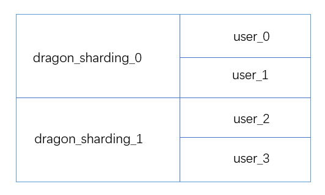

# Quick Start
## 环境搭建
#### 1 建库建表
按照如下方式建立2个分库，4个分表

建表sql如下：
    
    #========分库dragon_sharding_0==========================
    CREATE DATABASE IF NOT EXISTS dragon_sharding_0;
    USE dragon_sharding_0;
    
    CREATE TABLE `user_0` (
      `id` int(11) NOT NULL,
      `name` varchar(255) NOT NULL,
      PRIMARY KEY (`id`)
    ) ENGINE=InnoDB DEFAULT CHARSET=utf8;
    
    CREATE TABLE `user_1` (
      `id` int(11) NOT NULL,
      `name` varchar(255) NOT NULL,
      PRIMARY KEY (`id`)
    ) ENGINE=InnoDB DEFAULT CHARSET=utf8;
    
    #========分库dragon_sharding_1==========================
    CREATE DATABASE IF NOT EXISTS dragon_sharding_1;
    USE dragon_sharding_1;
    
    CREATE TABLE `user_2` (
      `id` int(11) NOT NULL,
      `name` varchar(255) NOT NULL,
      PRIMARY KEY (`id`)
    ) ENGINE=InnoDB DEFAULT CHARSET=utf8;
    
    CREATE TABLE `user_3` (
      `id` int(11) NOT NULL,
      `name` varchar(255) NOT NULL,
      PRIMARY KEY (`id`)
    ) ENGINE=InnoDB DEFAULT CHARSET=utf8;

#### 2 Maven依赖
pom.xml
    
    <dependencies>
             <dependency>
                 <groupId>com.tianshouzhi</groupId>
                 <artifactId>dragon-sharding-datasource</artifactId>
                 <version>1.0.0-SNAPSHOT</version>
             </dependency>
             <dependency>
                 <groupId>org.springframework</groupId>
                 <artifactId>spring-context</artifactId>
                 <version>4.2.7.RELEASE</version>
             </dependency>
             <dependency>
                 <groupId>org.springframework</groupId>
                 <artifactId>spring-jdbc</artifactId>
                 <version>4.2.7.RELEASE</version>
             </dependency>
             <dependency>
                 <groupId>org.mybatis</groupId>
                 <artifactId>mybatis-spring</artifactId>
                 <version>1.3.0</version>
             </dependency>
             <dependency>
                 <groupId>org.mybatis</groupId>
                 <artifactId>mybatis</artifactId>
                 <version>3.4.0</version>
             </dependency>
             <dependency>
                 <groupId>mysql</groupId>
                 <artifactId>mysql-connector-java</artifactId>
             </dependency>
             <dependency>
                 <groupId>org.slf4j</groupId>
                 <artifactId>slf4j-api</artifactId>
             </dependency>
             <dependency>
                 <groupId>ch.qos.logback</groupId>
                 <artifactId>logback-core</artifactId>
                 <version>1.1.7</version>
             </dependency>
             <dependency>
                 <groupId>ch.qos.logback</groupId>
                 <artifactId>logback-classic</artifactId>
             </dependency>
             <dependency>
                 <groupId>junit</groupId>
                 <artifactId>junit</artifactId>
             </dependency>
         </dependencies>
#### 新建实体User.java
    
    public class User {
        private Integer id;
        private String name;
        public User() {
        }
    
        public User(Integer id, String name) {
            this.id = id;
            this.name = name;
        }
    
        public Integer getId() {
            return id;
        }
    
        public void setId(Integer id) {
            this.id = id;
        }
    
        public String getName() {
            return name;
        }
    
        public void setName(String name) {
            this.name = name;
        }
    
        @Override
        public String toString() {
            return "User{" +
                    "id=" + id +
                    ", name='" + name + '\'' +
                    '}';
        }
    }
#### 配置mybatis
mybatis-config.xml

    <?xml version="1.0" encoding="UTF-8" ?>
    <!DOCTYPE configuration  PUBLIC "-//mybatis.org//DTD Config 3.0//EN"
            "http://mybatis.org/dtd/mybatis-3-config.dtd">
    <configuration>
        <typeAliases >
            <typeAlias type="com.tianshouzhi.dragon.demo.domain.User" alias="User"/>
        </typeAliases>
    
        <mappers>
            <mapper resource="mybatis/mappers/UserMapper.xml" />
        </mappers>
    
    </configuration>
UserMapper.xml
    
    <?xml version="1.0" encoding="UTF-8" ?>
    <!DOCTYPE mapper
            PUBLIC "-//mybatis.org//DTD Mapper 3.0//EN"
            "http://mybatis.org/dtd/mybatis-3-mapper.dtd">
    
    <mapper namespace="com.tianshouzhi.mybatis.dao.User">
        <resultMap id="userWithAccountMap" type="User">
            <!--主键-->
            <id property="id" column="id" javaType="java.lang.Integer" jdbcType="INTEGER"/>
            <!--普通属性-->
            <result  property="name" column="name" javaType="java.lang.String" jdbcType="VARCHAR"/>
        </resultMap>
        
        <insert id="insert" parameterType="User">
            INSERT INTO user (id,name) VALUES (#{id},#{name});
        </insert>
    
        <insert id="batchInsert" parameterType="java.util.List">
            INSERT INTO user (id,name) VALUES
            <foreach collection="list"  item="user" index="index" separator="," >
                (#{user.id},#{user.name})
            </foreach>  ;
        </insert>
    
        <select id="selectById" parameterType="int" resultType="User">
            SELECT id,name FROM user WHERE id=#{id};
        </select>
    
        <select id="selectAll" resultType="User">
            SELECT * FROM user;
        </select>
    
        <select id="selectOrderByLimit" resultType="User" parameterType="java.util.HashMap">
            SELECT id,name FROM user ORDER BY id limit #{offset},#{rows};
        </select>
    
        <select id="selectAggrGroupBy" resultType="java.util.HashMap">
            SELECT count(*),name FROM user GROUP BY name;
        </select>
    
        <select id="selectWhereIdIn" parameterType="integer[]" resultType="User">
            SELECT id,name FROM user WHERE id IN
            <foreach collection="array" item = "id" open="(" separator="," close=")">#{id}</foreach>;
        </select>
    
        <update id="updateById" parameterType="User">
            UPDATE user SET name=#{name} where id=#{id};
        </update>
        
        <update id="batchUpdate" parameterType="list">
            UPDATE user
            <trim prefix="SET" suffixOverrides=",">
                <trim prefix="name =CASE id" suffix="END,">
                    <foreach collection="list" item="user" index="index">
                        WHEN #{user.id} THEN #{user.name}
                    </foreach>
                </trim>
            </trim>
            WHERE id IN
            <foreach collection="list" item = "user" open="(" separator="," close=")">#{user.id}</foreach>;
        </update>
    
        <delete id="deleteById" parameterType="int" >
            DELETE FROM user WHERE id=#{id};
        </delete>
    
        <delete id="deleteAll">
            DELETE FROM user;
        </delete>
    
        <delete id="batchDelete" parameterType="integer[]">
            DELETE FROM user WHERE id in
            <foreach collection="array" item = "id" open="(" separator="," close=")">#{id}</foreach>;
        </delete>
    
    </mapper>
#### 新建dragon配置文件：dragon-sharding.properties 

    #===============================数据源配置开始，配置项key以datasource开头=====================================
    datasource.namePattern=dragon_sharding_{0}
    datasource.list=dragon_sharding_0,dragon_sharding_1
    
    datasource.datasourceClass=com.alibaba.druid.pool.DruidDataSource
    
    #数据源属性配置 格式:datasource.<datasourceIndex>.<propertyName>
    datasource.default.username=root
    datasource.default.password=shxx12151022
    datasource.default.driverClassName=com.mysql.jdbc.Driver
    
    datasource.dragon_sharding_0.url=jdbc:mysql://localhost:3306/dragon_sharding_0?useSSL=false
    datasource.dragon_sharding_1.url=jdbc:mysql://localhost:3306/dragon_sharding_1?useSSL=false
    
    logicTable.default.dragon_sharding_0.mapping=#logicTable#_[0,1]
    logicTable.default.dragon_sharding_1.mapping=#logicTable#_[2,3]
    #==============================逻辑表配置开始,配置项key以logicTable开头=======================================
    logicTable.list=user
    logicTable.user.namePattern=user_{0}
    logicTable.user.dbRouteRules=(${id}.toLong()%4).intdiv(2)
    logicTable.user.tbRouteRules=${id}.toLong()%4

#### 配置Spring：dragon-spring.xml

    <?xml version="1.0" encoding="UTF-8"?>
    <beans xmlns="http://www.springframework.org/schema/beans"
           xmlns:xsi="http://www.w3.org/2001/XMLSchema-instance"
           xsi:schemaLocation="http://www.springframework.org/schema/beans http://www.springframework.org/schema/beans/spring-beans.xsd">
        <!--配置Dragon数据源-->
        <bean id="dragon-datasource" class="com.tianshouzhi.dragon.sharding.jdbc.datasource.DragonShardingDataSource">
            <constructor-arg value="dragon-sharding.properties"/>
        </bean>
        <!--配置Mybatis-->
        <bean id="sqlSessionFactory" class="org.mybatis.spring.SqlSessionFactoryBean">
            <property name="dataSource" ref="dragon-datasource"></property>
            <property name="configLocation" value="mybatis/sqlMapConfig.xml"></property>
        </bean>
    </beans>

#### 测试 DragonSpringMybatisTest.java

    public class DragonSpringMybatisTest {
        private static   SqlSession sqlSession=null;
        @BeforeClass
        public static void beforeClass(){
            ApplicationContext context=new ClassPathXmlApplicationContext("sequence-shard/dragon-spring.xml");
            SqlSessionFactory sqlSessionFactory= (SqlSessionFactory) context.getBean("sqlSessionFactory");
            sqlSession=sqlSessionFactory.openSession();
        }
    
        @Test
        public void testInsert(){
            User user=new User();
            user.setId(10);
            user.setName("tianshouzhi");
            int num=sqlSession.insert("com.tianshouzhi.mybatis.dao.User.insert",user);
            System.out.println(num);
        }
    
        @Test
        public void testBatchInsert(){
            List<User> userList=new ArrayList<User>();
            userList.add(new User(2,"tianhui2"));
            userList.add(new User(3,"tainmin3"));
            userList.add(new User(4,"tianhui4"));
            userList.add(new User(5,"tainmin5"));
            userList.add(new User(6,"tianhui6"));
            userList.add(new User(7,"tainmin7"));
            userList.add(new User(8,"tianhui8"));
            userList.add(new User(9,"tainmin9"));
            int insertNum= sqlSession.insert("com.tianshouzhi.mybatis.dao.User.batchInsert",userList);
            System.out.println(insertNum);
        }
    
    
        @Test
        public void testSelectById(){
            User user=sqlSession.selectOne("com.tianshouzhi.mybatis.dao.User.selectById",1);
            System.out.println(user);
        }
        @Test
        public void testSelectWhereIdIn(){
            int[] selectIds=new int[]{1,2,3};
            List<User> userList=sqlSession.selectList("com.tianshouzhi.mybatis.dao.User.selectWhereIdIn",selectIds);
            printList(userList);
        }
        @Test
        public void testSelectAll(){
            List<User> userList=sqlSession.selectList("com.tianshouzhi.mybatis.dao.User.selectAll");
            printList(userList);
        }
        @Test
        public void testSelectOrderByLimit(){
            HashMap<String, Integer> params = new HashMap<String, Integer>();
            params.put("offset",0);
            params.put("rows",5);
            List<User> userList=sqlSession.selectList("com.tianshouzhi.mybatis.dao.User.selectOrderByLimit",params);
            printList(userList);
        }
        @Test
        public void testAggrGroupBy(){
            List<Map<String,Object>> result=sqlSession.selectList("com.tianshouzhi.mybatis.dao.User.selectAggrGroupBy");
            printList(result);
        }
    
        @Test
        public void testDeleteById(){
            int num=sqlSession.delete("com.tianshouzhi.mybatis.dao.User.deleteById",2);
            System.out.println(num);
        }
        @Test
        public void testDeleteAll(){
            int deleteNums = sqlSession.delete("com.tianshouzhi.mybatis.dao.User.deleteAll");
            System.out.println(deleteNums);
        }
    
        @Test
        public void testBatchDelete(){
            int[] deleteIds=new int[]{10001,10000,10101};
            int deleteNums = sqlSession.delete("com.tianshouzhi.mybatis.dao.User.batchDelete",deleteIds);
            System.out.println(deleteNums);
        }
    
        @Test
        public void testUpdateById(){
            User user=sqlSession.selectOne("com.tianshouzhi.mybatis.dao.User.selectById",1);
            System.out.println(user);
            user.setName("wangxiao xiao");
            int num=sqlSession.update("com.tianshouzhi.mybatis.dao.User.updateById",user);
            System.out.println(num);
        }
        @Test
        public void testUpdateCaseWhen() throws SQLException {
            List<User> userList=new ArrayList<User>();
            userList.add(new User(1,"case when"));
            userList.add(new User(2,"case when"));
            userList.add(new User(3,"case when"));
            userList.add(new User(7,"case when"));
            int num=sqlSession.update("com.tianshouzhi.mybatis.dao.User.updateCaseWhen",userList);
            System.out.println(num);
        }
    
        public void printList(List<? extends Object> userList) {
            for (Object obj : userList) {
                System.out.println(obj);
            }
        }
    }
    
在测试时，注意方法的先后执行顺序和进行验证。    
    